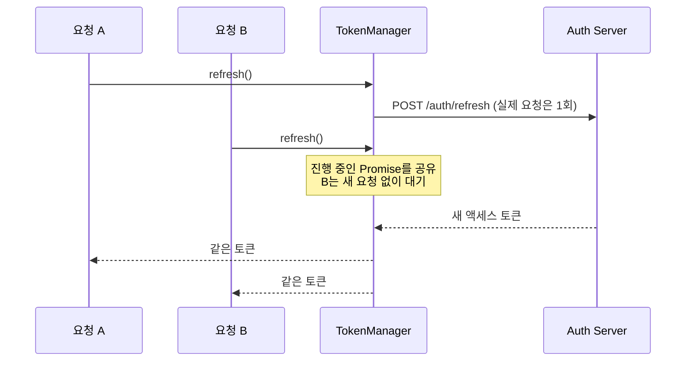

# token-refresh-playground

[](https://github.com/aqumon12/token-refresh-playground/actions/workflows/ci.yml)

실무(하이브리드 WebView 앱)에서 겪은 **액세스 토큰 무한 재요청 루프**를 해결하며 정리한
single-flight 토큰 재발급 패턴을, NestJS 서버까지 포함해 처음부터 재구현하고 테스트로 증명한 저장소입니다.

> 문제의 원인 분석과 해결 과정: [aqumon.dev](https://aqumon.dev)

## 문제

액세스 토큰이 만료되는 순간, 화면의 여러 요청이 **동시에 401**을 받는다.
각 요청이 저마다 재발급을 호출하면:

- 재발급 API에 불필요한 중복 호출이 몰리고
- (토큰이 회전되는 경우) 늦게 도착한 재발급이 앞선 토큰을 무효화하는 경쟁 상태가 생긴다

## 해결 — single-flight



- 진행 중인 재발급 Promise를 하나만 유지 — 동시 호출은 전부 같은 Promise를 기다린다
- 성공/실패와 무관하게 완료 후 반드시 비워서, 실패한 Promise가 다음 재발급을 막지 않게 한다
- **세션 폐기는 서버가 인증을 거부했을 때만** — 네트워크 오류·5xx에 로그아웃시키지 않는다

## 구조

```
apps/api           NestJS 인증 서버 — 로그인 · 재발급(고의 150ms 지연) · 보호 리소스
                   재발급 호출 횟수를 세는 카운터 포함 (통합 테스트의 증거 장치)
packages/client    순수 TS — createTokenManager(single-flight) · createApiClient(401 재시도 1회)
```

## 검증

**단위 테스트** (`packages/client`) — 7개

- 동시 refresh 5건 → 실제 재발급 1회, 전원 같은 토큰
- 실패한 재발급 Promise가 남지 않아 다음 시도가 가능
- 세션 폐기는 `SessionExpiredError`일 때만, 네트워크 오류엔 세션 유지
- 401 → 재발급 → **정확히 1회만** 재시도 (무한 루프 방지)

**통합 테스트** (`apps/api`) — 2개, **목(mock) 없이 진짜 NestJS 서버를 띄워서**

- 만료 토큰으로 동시 요청 5개 → 전부 200, **서버가 받은 재발급 호출은 1회** (서버 카운터로 증명)
- 리프레시 토큰 폐기 후 → 모든 요청이 `SessionExpiredError`로 수렴, 세션 정리 콜백은 1회만

## 실행

```bash
pnpm install
pnpm test        # 단위 + 통합 전체
pnpm --filter @playground/api start   # 서버 단독 실행 (localhost:3000)
```
